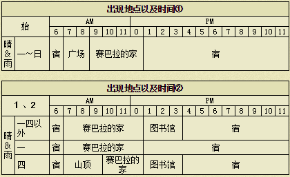

# 格雷

酷酷的男孩。因为祖父总是对他不满意而感到沮丧。
喜欢玛丽，所以经常在图书馆出没——意不在书，在乎MM之间也。。

## 基本资料

生日：冬6日
住址：塞巴拉的锻冶屋
人际关系：塞巴拉的孙子
竞争对手：玛丽

在锻冶屋打造15次+2500爱情度

## 基本行程

## 喜欢与讨厌的东西

注：特别喜欢：爱情度+800 很喜欢：爱情度+500 喜欢：爱情度+300 普通：爱情度+100 讨厌：爱情度-500 非常讨厌：爱情度-800

### 非常喜欢

- 哦，谢谢！还是有朋友好啊，哈哈。
巧克力、大回力剂、大醒神剂、咖喱饭、炒饭、锅烙、烤马铃薯、烤玉米、地瓜布丁、烤地瓜、蛋炒饭、布丁、奶酪蛋糕、苹果派、咖喱面包、乌冬烧、大学芋、冰激淋、蛋糕、巧克力蛋糕、热蛋糕、铜、银、金、秘银、奥里哈钢、金刚石、月亮石、紫水晶、沙漠玫瑰石、玛瑙、萤石、橄榄石、黄玉、红宝石、祖母绿、钻石、粉红钻石、亚历山大石

### 喜欢

- 哇，太棒了！下次再送我什么啊。
马铃薯、番茄、玉米、蛋（S、M、L、G、P、X）、蛋黄酱（S、M、L、G、P、X）、奶酪（S、M、L、G、P、X）、葡萄酒、面包、年糕、野葡萄酒、炖品、番茄酱、爆米花、玉米片、炒鸡蛋、干酪、奶油烤面包、土司、比萨、咖喱乌冬、干烧伊面、赏月丸子、烤年糕、粥、鸡蛋饭、炸肉饼、大鱼、枝、木材

### 普通

- 哦，谢谢。
青瓜、草莓、包心菜、洋葱、南瓜、菠萝、茄子、地瓜、菠菜、野葡萄、蜂蜜、苹果、蘑菇、松蘑、牛奶（S、M、L、G、P、X）、青色草、绿色草、橙色草、紫色草、蓝色草、黑色草、白色草、葡萄汁、油、小麦粉、咖喱粉、饭团、回力剂、醒神剂、ＳＵＧＤＷ苹果、ＨＭＳＧＢ苹果、ＡＥＰＦＥ苹果、沙拉、味噌汤、炒青菜、三文治、果汁、果奶、菜汁、菜奶、调和汁、混合奶、草莓酱、草莓牛奶、菠萝汁、南瓜布丁、炖南瓜、菜肉蛋卷、煮鸡蛋、热牛奶、奶油、苹果酱、苹果烧、葡萄酱、蘑菇饭、松蘑饭、寿司、果酱面包、葡萄面包、法国土司、鱼片、煮鱼、什锦寿司、乌冬、天麸锣盖浇饭、荞面条、天麸罗面、天麸罗、烤饭团、天麸罗饭、鱼糕、曲奇、巧克力曲奇、消闲茶、消闲茶叶、回复草、小鱼、中鱼、春的太阳、夏的太阳、秋的太阳、冬的太阳、三色花、月泪草、猫薄荷、青色奇幻草、红色奇幻草、羊毛（S、M、L、G、P、X）、毛线团（S、M、L、G、P、X）、迷之石板

### 讨厌

- …那我收下吧，虽然我讨厌那种东西。
萝卜、胡萝卜、青椒、竹笋、温泉蛋、黄色草、肉丸粉、荞麦粉、番茄汁、竹笋饭、烫荞面、筑前煮、废矿石、贤者之石

### 非常讨厌

- 你好恶心啊！拿那种东西给我看干嘛？
毒蘑菇、红色草、腌青瓜、腌萝卜、酱烤茄子、凉拌青菜、失败作（在碟子上的、饮品、盛在锅里的、点心、面包、乌冬）、杂草、石、海盗之宝、古代鱼化石、空罐、长靴、鱼骨、黄金木材、饲料、鸡饲料、装信的瓶子

### 其他

- 哦，是爷爷做的吗…那我收下了，爷爷的作品很少人有的…
手镯、项链、耳环、胸针

你经常送女孩子礼物吧？
香水

哦，你拿的什么好东西？是给我的？你顺便送我妈妈点东西吧。
裙子、面膜、润肤霜、防晒霜

## 恋爱事件

|
|:-:
|时间：星期2、5、6、日 / AM10:00~PM1:00
|地点：煅冶屋
|选项：第一个

|
|:-:
|时间：星期2、4、6、日 / PM5:00~PM8:00
|地点：旅馆二楼
|选项：第二个

|
|:-:
|时间：星期1 / 一出门就碰上了
|地点：自家门口
|选项：第一个

|
|:-:
|时间：星期1 / am10:00~pm1:00
|地点：煅冶屋
|选项：第一个
