# 女神大人

- 住在泉中，有关于女神的一切都很神秘。
- **男孩版隐藏结婚对象**

## 基本资料

生日：春8日（春9日）
住址：女神之泉
喜欢的东西：草莓、菠萝
竞争对手：河童（大雾）

## 出现地点以及时间

往泉里丢东西就可以见到了

## 喜欢与讨厌的东西

注：特别喜欢：爱情度+800 很喜欢：爱情度+500 喜欢：爱情度+300 普通：爱情度+100 讨厌：爱情度-500 非常讨厌：爱情度-800

### 非常喜欢

- 对了，你刚才给我的供品我很喜欢。再见。
草莓、菠萝

### 喜欢

- 对了，你刚才给我的供品我非常喜欢。再见。
萝卜、马铃薯、青瓜、包心菜、番茄、玉米、洋葱、南瓜、茄子、胡萝卜、地瓜、菠菜、青椒、蛋（S、M、L、G、P、X）、牛奶（S、M、L、G、P、X）、消闲茶叶、三色花、月泪草、猫薄荷、青色奇幻草、红色奇幻草

### 普通

- 对了，你刚才给我的供品我说不上喜欢，也不能说讨厌。再见。
竹笋、野葡萄、蜂蜜、苹果、蘑菇、松蘑、温泉蛋、蛋黄酱（S、M、L、G、P、X）、奶酪（S、M、L、G、P、X）、青色草、绿色草、红色草、黄色草、橙色草、紫色草、蓝色草、黑色草、白色草、ＳＵＧＤＷ苹果、ＨＭＳＧＢ苹果、ＡＥＰＦＥ苹果、小鱼、中鱼、大鱼、春的太阳、夏的太阳、秋的太阳、冬的太阳、羊毛（S、M、L、G、P、X）、毛线团（S、M、L、G、P、X）

### 讨厌

- 对了，你刚才给我的供品我很讨厌。再见。
毒蘑菇、葡萄酒、葡萄汁、肉丸粉、巧克力、油、小麦粉、咖喱粉、饭团、面包、回力剂、大回力剂、醒神剂、大醒神剂、荞麦粉、年糕、野葡萄酒、腌青瓜、沙拉、咖喱饭、炖品、味噌汤、炒青菜、炒饭、锅烙、三文治、果汁、果奶、菜汁、菜奶、调和汁、混合奶、腌萝卜、烤马铃薯、草莓酱、草莓牛奶、番茄汁、番茄酱、爆米花、玉米片、烤玉米、菠萝汁、南瓜布丁、炖南瓜、酱烤茄子、地瓜布丁、烤地瓜、凉拌青菜、炒鸡蛋、菜肉蛋卷、蛋炒饭、煮鸡蛋、布丁、热牛奶、奶油、奶酪蛋糕、干酪、苹果派、苹果酱、苹果烧、竹笋饭、葡萄酱、蘑菇饭、松蘑饭、寿司、果酱面包、奶油烤面包、葡萄面包、咖喱面包、土司、法国土司、鱼片、煮鱼、什锦寿司、比萨、乌冬、咖喱乌冬、天麸锣盖浇饭、乌冬烧、荞面条、天麸罗面、干烧伊面、烫荞面、天麸罗、筑前煮、赏月丸子、烤年糕、烤饭团、粥、天麸罗饭、鸡蛋饭、大学芋、炸肉饼、鱼糕、曲奇、巧克力曲奇、冰激淋、蛋糕、巧克力蛋糕、热蛋糕、消闲茶、回复草、失败作（在碟子上的、饮品、盛在锅里的、点心、面包、乌冬）、废矿石、铜、银、金、秘银、奥里哈钢、金刚石、贤者之石、月亮石、紫水晶、沙漠玫瑰石、玛瑙、萤石、橄榄石、黄玉、红宝石、祖母绿、钻石、粉红钻石、亚历山大石、手镯、项链、耳环、胸针、香水、裙子、面膜、润肤霜、防晒霜、杂草、石、枝、木材、饲料、鸡饲料、迷之石板、装信的瓶子

### 非常讨厌

- 怎么给我这种东西？讨厌！
海盗之宝、古代鱼化石、空罐、长靴、鱼骨、黄金木材

## 和女神的结婚条件

- 和女神的爱情度 60000 以上，有大床、青色羽毛
- 能出货的东西全出过(共103种物品)
- 泉矿和湖矿的东西全发现过
- 钓到所有的鱼
- 得到女神密宝
- 忏悔时选“想和女神结婚”并得到原谅
- 游戏时间 5 年以上

## 爱情事件

达成一个爱情 +3000

- 两个矿场分别达到100、200、255层
- 万步计达到　1W、10W、100W、1000W、1亿、10亿
- 物品单个出货1W、10W、100W、1000W、1亿、10亿
- 钓鱼数量　　1W、10W、100W、1000W、1亿、10亿

### 与女神结婚的图

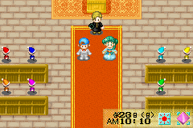
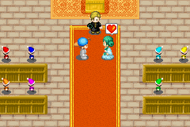
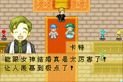
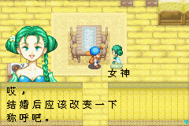
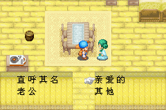
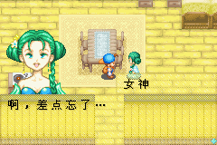
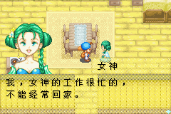

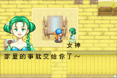
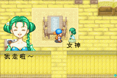
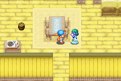
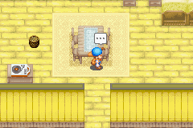
