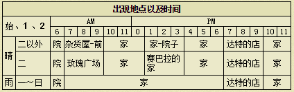

# 里克

戴着眼睛，感觉上像比较纯情的书生——不喜欢凯。
千方百计地想要阻止珀布利接近他，但收效甚微，喜欢卡莲。

## 基本资料

生日：秋27日
住址：养鸡场
喜欢的东西：热牛奶、赏月丸子、红色奇幻草
人际关系：莉莉雅的儿子、珀布利的哥哥
竞争对手：卡莲

鸡屋增筑后，有8只鸡后，鸡的平均心数每增加一颗+2500爱情度

## 基本行程

## 喜欢与讨厌的东西

注：特别喜欢：爱情度+800 很喜欢：爱情度+500 喜欢：爱情度+300 普通：爱情度+100 讨厌：爱情度-500 非常讨厌：爱情度-800

### 非常喜欢

- 哦，谢谢你。你真是好男人。
玉米、蜂蜜、温泉蛋、蛋（S、M、L、G、P、X）、蛋黄酱（S、M、L、G、P、X）、奶酪（S、M、L、G、P、X）、葡萄酒、巧克力、回力剂、大回力剂、醒神剂、大醒神剂、野葡萄酒、草莓牛奶、爆米花、玉米片、炒鸡蛋、菜肉蛋卷、蛋炒饭、布丁、法国土司、鸡蛋饭、巧克力蛋糕、大鱼、鸡饲料

### 喜欢

- 哦，谢谢。那我收下了。
菠萝、蘑菇、青色草、绿色草、紫色草、蓝色草、黑色草、白色草、葡萄汁、饭团、炒青菜、果汁、调和汁、烤马铃薯、草莓酱、番茄酱、菠萝汁、南瓜布丁、凉拌青菜、奶酪蛋糕、葡萄面包、咖喱乌冬、天麸锣盖浇饭、干烧伊面、烤饭团、粥、鱼糕、巧克力曲奇、消闲茶、消闲茶叶、中鱼、青色奇幻草、红色奇幻草、紫水晶、黄玉、红宝石、祖母绿、木材

### 普通

- 哦，谢谢。
萝卜、马铃薯、青瓜、草莓、包心菜、番茄、洋葱、茄子、胡萝卜、菠菜、青椒、竹笋、野葡萄、苹果、松蘑、牛奶（S、M、L、G、P、X）、橙色草、肉丸粉、油、小麦粉、咖喱粉、面包、荞麦粉、ＳＵＧＤＷ苹果、ＨＭＳＧＢ苹果、ＡＥＰＦＥ苹果、腌青瓜、沙拉、味噌汤、炒饭、锅烙、三文治、果奶、菜汁、菜奶、混合奶、腌萝卜、番茄汁、烤玉米、酱烤茄子、地瓜布丁、奶油、苹果派、苹果酱、苹果烧、竹笋饭、葡萄酱、蘑菇饭、松蘑饭、寿司、果酱面包、奶油烤面包、土司、鱼片、煮鱼、什锦寿司、比萨、乌冬、乌冬烧、荞面条、天麸罗面、烫荞面、天麸罗、筑前煮、赏月丸子、天麸罗饭、大学芋、炸肉饼、曲奇、冰激淋、蛋糕、热蛋糕、回复草、小鱼、春的太阳、夏的太阳、秋的太阳、冬的太阳、三色花、月泪草、猫薄荷、橄榄石

### 讨厌

- 嗯，那我收下了。
南瓜、地瓜、黄色草、年糕、炖南瓜、烤地瓜、煮鸡蛋、热牛奶、烤年糕

### 非常讨厌

- 哇！你在干什么啊！？
毒蘑菇、红色草、咖喱饭、炖品、干酪、咖喱面包、失败作（在碟子上的、饮品、盛在锅里的、点心、面包、乌冬）、羊毛（S、M、L、G、P、X）、毛线团（S、M、L、G、P、X）、废矿石、铜、银、金、秘银、奥里哈钢、金刚石、贤者之石、月亮石、沙漠玫瑰石、玛瑙、萤石、钻石、粉红钻石、亚历山大石、杂草、石、枝、海盗之宝、古代鱼化石、空罐、长靴、鱼骨、黄金木材、饲料、迷之石板、装信的瓶子、紫水晶、黄玉、红宝石

### 其他

- 好漂亮啊。妈妈看了一定会很高兴。
手镯、项链、耳环、胸针

- 男人拿着这种东西在街上跑会很奇怪吧？
香水

- 我用不上了。不过妈妈应该会喜欢吧？
裙子、面膜、润肤霜、防晒霜

## 恋爱事件

|
|:-:
|时间：星期1、3、5 / AM11:00~PM1:00
|地点：养鸡场
|选项：第一个

|
|:-:
|时间：星期2、4、6 / AM11:00~PM1:00
|地点：养鸡场
|选项：第一个

|
|:-:
|时间：星期1、3、5、6 / AM11:00~PM1:00
|地点：养鸡场
|选项：第二个

|
|:-:
|时间：星期2、3、5 / PM8:00~PM10:00 （要等里克进去后才进去）
|地点：旅馆
|选项：第一个
