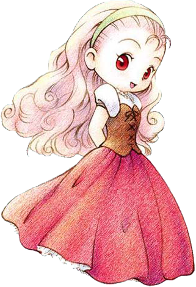
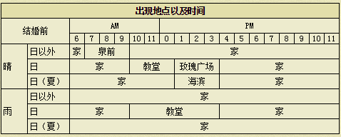

# 珀布利

一个多愁善感的女孩子，她的梦想是早日离开矿石小镇，寻找新的天地。另外好象很讨厌小孩子来烦……

## 基本资料

生日：夏季3日(与主角生日相同时会推迟到夏10日）
住址：养鸡场
喜欢的东西：炒鸡蛋、菜肉蛋卷、蛋炒饭
人际关系：莉莉雅的女儿、里克的妹妹
竞争对手：凯伊

※养8只鸡，鸡的平均心数达5、8、9、10时爱情度加2500。

## 基本行程

## 喜欢与讨厌的东西

注：特别喜欢：爱情度+800 很喜欢：爱情度+500 喜欢：爱情度+300 普通：爱情度+100 讨厌：爱情度-500 非常讨厌：爱情度-800

### 特别喜欢

- 哇！我太喜欢了。谢谢你。
炒鸡蛋、菜肉蛋卷、蛋炒饭

### 很喜欢

- 哇，谢谢。（主角姓名）你送的东西我很喜欢。
草莓、苹果、蛋（一般、高品质、特级、金、P、X）、巧克力、ＳＵＧＤＷ苹果、ＨＭＳＧＢ苹果、ＡＥＰＦＥ苹果、三文治、果汁、草莓酱、草莓牛奶、煮鸡蛋、布丁、苹果派、苹果酱、苹果烧、鸡蛋饭、曲奇、巧克力曲奇、冰激淋、蛋糕、巧克力蛋糕、热蛋糕、消闲茶、钻石、粉红钻石

### 喜欢

- 哇，谢谢
菠萝、蜂蜜、蛋黄酱（S、M、L、G、P、X）、牛奶（S、M、L、G、P、X）、葡萄汁、小麦粉、面包、炖品、锅烙、烤马铃薯、番茄酱、爆米花、烤玉米、菠萝汁、南瓜布丁、地瓜布丁、热牛奶、竹笋饭、葡萄酱、土司、法国土司、什锦寿司、大学芋、消闲茶叶、三色花、猫薄荷、毛线团（S、M、L、G、P、X）

### 普通

- 谢谢。
马铃薯、黄瓜、包心菜、番茄、玉米、洋葱、胡萝卜、地瓜、菠菜、竹笋、野葡萄、蘑菇、松蘑、温泉蛋、奶酪（S、M、L、G、P、X）、肉丸粉、油、咖喱粉、饭团、腌黄瓜、沙拉、咖喱饭、味噌汤、炒青菜、炒饭、果奶、玉米片、烤地瓜、凉拌青菜、奶油、奶酪蛋糕、干酪、蘑菇饭、松蘑饭、寿司、果酱面包、奶油烤面包、葡萄面包、咖喱面包、鱼片、煮鱼、比萨、乌冬、咖喱乌冬、天麸锣盖浇饭、乌冬烧、荞面条、天麸罗面、干烧伊面、烫荞面、天麸罗、筑前煮、赏月丸子、烤饭团、粥、天麸罗饭、炸肉饼、鱼糕、回复草、小鱼、中鱼、大鱼、春的太阳、夏的太阳、秋的太阳、冬的太阳、月泪草、青色奇幻草、红色奇幻草、羊毛（S、M、L、G、P、X）、金刚石、杂草

### 讨厌

- 我讨厌这个！
萝卜、南瓜、茄子、青椒、荞麦粉、年糕、菜汁、菜奶、调和汁、混合奶、腌萝卜、番茄汁、炖南瓜、酱烤茄子、烤年糕、废矿石、铜、银、金、秘银、奥里哈钢、贤者之石、月亮石、紫水晶、沙漠玫瑰石、玛瑙、萤石、橄榄石、黄玉、红宝石、祖母绿、亚历山大石

### 非常讨厌

- 呀，讨厌！…我不要。
毒蘑菇、青色草、绿色草、红色草、黄色草、橙色草、紫色草、蓝色草、黑色草、白色草、葡萄酒、回力剂、大回力剂、醒神剂、大醒神剂、野葡萄酒、失败作（在碟子上的、饮品、盛在锅里的、点心、面包、乌冬）、石、枝、海盗之宝、古代鱼化石、空罐、长靴、鱼骨、木材、黄金木材、饲料、鸡饲料、迷之石板、装信的瓶子

### 其他

- 啊，这是给我的？太棒了！感觉自己像个大人了。
手镯、项链、耳环、胸针

- 这是什么？哦，香水…什么，给我的？哇，谢谢。
香水

- 这是给我的？太棒了！我要拿去给妈妈看。
裙子、面膜、润肤霜、防晒霜

## 恋爱事件

|
|:-:
|时间：三、五 AM11:00至PM6:00
|地点：养鸡场（从锻冶屋走出来后会发生）
|选“喜欢”，珀布利的爱情度+3000 选“不喜欢”，珀布利的爱情度-2000

|
|:-:
|时间：一至六 AM6:00至PM1:00
|地点：自己的牧场
|选“好啊”，珀布利的爱情度+3000 选“很忙，没空”，珀布利的爱情度-2000

|
|:-:
|时间：夏天以外 日 AM10:00至PM1:00
|地点：教堂
|选“一起玩”，珀布利的爱情度+3000，优好感度-10，梅和卡特好感度+20，背包有空格可得到「珀布利的小泥团」 选“有点事”，珀布利的爱情度不变，优和卡特好感度-10，梅好感度+20

|
|:-:
|时间：夏天以外 二、日以外
|地点：养鸡场
|选“珀布利说的没错”，珀布利的爱情度+3000，里克好感度-10，莉莉雅好感度+20 选“ 里克说的没错”，珀布利的爱情度-2000，里克好感度+20，莉莉雅好感度-10 选“莉莉雅很为难啊”，珀布利的爱情度+3000，里克和莉莉雅好感度+20
