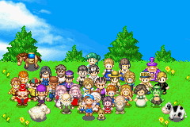
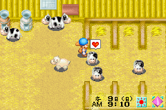

# 矿石镇的伙伴们

《牧场物语 矿石镇的伙伴们》是Marvelous Interactive製作的游戏，在2003年4月18日发售，平台为Game Boy Advance，是《牧场物语》系列的一员。游戏本身是前作中秋满月的移植作品，因此在人物设定方面都有著共通点。不过，由于受GBA的性能所限，整个游戏是以2D形式进行。另外，游戏有著更多的隐藏元素，例如可以建设别墅，料理增加至108种。

## 游戏评价

《牧场物语：矿石镇的伙伴们》是牧场物语系列在GBA平台的第一款，虽然是第一作但是素质一点都不差。

其完美的画面及音效立刻征服了玩家。游戏保持一贯的作风，并且比GBX版有大幅的强化，并且可与NGC联动。游戏主角是一个农场的管理员，通过自己辛勤的劳动，种地、钓鱼、放牧、养鸡、挖矿等等来攒积金钱，建设自己的农场。而且游戏中还加入了不少有趣的设定。例如劳动时辛苦的脸变蓝了然后进医院是个有趣的设定，游戏里的这种细节刻画很成功，成为GBA屈指可数的大作之一。

牧场物语曾在许多主机平台上有其身影：SFC、N64、NGC、PS、PSP、PS2、GB、GBA……如果之前玩过『牧场物语～中秋之月～The　Best』的话玩这款游戏会发现有很多相似的地方，就好像是从PS上移植过来一样。其实不仅仅如此，GBA版的牧场加入了非常多新的隐藏要素。如：料理从PS版40多种增加到108种，可以建设别墅（条件很苛刻……）还有很多很多新增要素，就不在这里一一列举了。

还有一点非常重要的就是，和GC『牧场物语～美丽人生～』联动方面。不再和以往GB版牧场联动只是交换物件那么简单了。以下是官方的介绍：GAMECUBE舞台中的「遗忘谷」和GBA舞台中的「矿石小镇」，被一座很高的山壁所阻挡，因此是相邻的存在。 这两个小镇，可藉由GAMECUBE和GBA的接续，变得可以往来互动。产生新的事件，也让人们的对话改变，使牧场物语的世界更加广阔更加好玩！有条件的玩家一定要试试看。

如果你对这款游戏完全陌生的话……简要来说呢，这种类型的游戏很适合女生玩。不过男生也不要不好意思，一起来试试看吧。游戏主要内容就是：管理一个牧场，和村子里的人们互动，以及追求可爱的MM们。还有255层的矿石场等你去挖透。

## 故事背景

### 男孩版

男主角小时候因为迷路，结果误打误撞下刚好走进矿石镇的牧场裡，在牧场主人的帮忙下，男主角顺利找到父母，并一起在牧场裡游玩几天。而随时间流逝，长大后的男主角再度返回牧场时，牧场主人却不在了。在镇长的建议下，男主角接下了牧场工作，而故事也随之展开。

### 女孩版

女主角对都市生活感到厌倦，但却在偶然的机会下于报纸上看到牧场的消息，便辞掉的工作前往矿石镇。但抵达后女主角才发现牧场早已荒芜，一切美好消息全都是镇长的谎言，但即便如此，女主角仍一肩扛起牧场工作，而故事也随之展开。

## 游戏截图

全家福

牧场的一角

## 版本差异

女孩版比男孩版有著更多的游戏元素。只要购入镜子，就可以更换衣服。女孩每天更换衣服，可以增加村民的友好度和爱情度。另外，女孩版可以饲养鱼类，把鱼放在水池就可以饲养。

游戏期间，会有发生特殊事件。同样的事件，对男孩和女孩可能会有相反的效果。

## 外部链接

**官方网站**

- [男孩版](http://www.bokumono.com/series/cube_gba/gba/index.html)
- [女孩版](http://www.bokumono.com/series/cube_gba_girl/gba/index.html)
