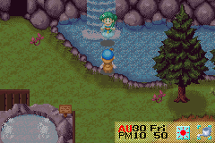
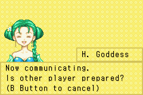
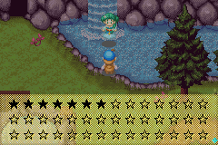
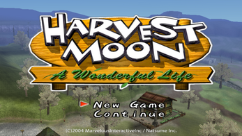
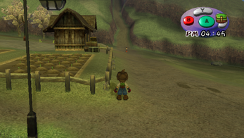
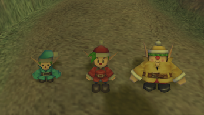
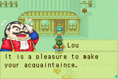

# 联机

- 矿石镇可以与GC的美丽人生进行联机。
- 实体机需要一条GC-GBA传输线。
- 模拟器需要VBALINK和Dolphin这两个模拟器

## 具体步骤

### 等待联机状态

### 黑色的就是这次得到的星数

### 旁边那条小山路

### 遇到小精灵

### 遇到班

## 其他说明

联动完后矿石镇的图书馆二楼书架
可以查到有关GC人物的简介(端视GC存档玩的状况)
镇民偶尔也会聊到有关消息
虽然会纪录资讯,但同一个GC存档可以重复连动没问题
海的别墅是最好拿的一个了...不论实机或模拟器
只不过过程很无聊
