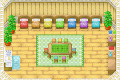

# 小矮人的家

他们居住在教堂旁边的一幢小房子里。和他们搞好关系可以请他们帮你干活喔。
另外春季的时候这里会举行茶会，关系好的话他们也会邀请你参加。

## 开放时间

- 时间：AM9:00~PM6:00
- 除特定的节日外全年无休

## 对话

### 委托干活

- 浇水
- 收获
- 照顾动物

#### 注意事项

1. 精灵照顾动物的时候会自动挤奶，剪羊毛，用刷子清洁牛羊，喂草料，捡鸡蛋，这些都会增加动物友好度，但和动物说话，抱鸡这个不会干，要自己动手。
2. 尤其是鸡，只有抱鸡一项可以增加友好度，所以别忘了哦~
3. 干农活要提前一天预约，可以选择是干1天，3天，一周。
4. 成功后第二天出门就会看到精灵们进入牧场了。
5. 在牧场上可以和精灵们聊天，也可以送东西，会增加友好度哦。
6. 精灵干完活后会休息。所以要安排好时间。

### [一起玩游戏](/place/game.md)

- 浇水
- 收获
- 照顾动物
