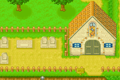
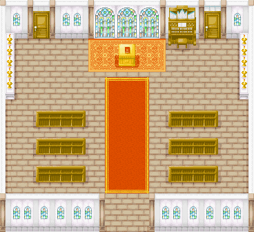

# 教堂

如果天气好的话，你可以在外面看到卡特在外面照看着孩子们。
和卡特关系好的话还能进入教堂后院。
一些诅咒农具也可以在这里解除诅咒喔。
若做了什么不好的事请去忏悔室忏悔试试吧

## 开放时间

AM10点到PM6点 除特定的节日外全年无休

## 忏悔

忏悔室开放时间 星期一、星期三或任意雨雪天的PM1点到PM4点可以进入教堂左边的门忏悔

获得神的原谅(随机的)后效果如下：

- 欺负动物,没怎么照顾动物：全体动物好感＋5 
- 随手扔垃圾,不受镇里人欢迎:全体村民好感＋2 
- 睡懒觉,使用道具直到晕倒,每天都睡不着:疲劳－2或体力+10 
- 让小矮人帮忙干活:全体精灵好感＋2 

如果说神都不会原谅你,给你惩罚之类的，对你没有任何影响。

## 进全部房间所需条件

- 教堂左门
周一、周三或者下雨的任一天 PM1;00~PM4:00
- 教堂右门
卡特友好100以上后触发事件 解梦事件 或 采蘑菇事件 任一即可
