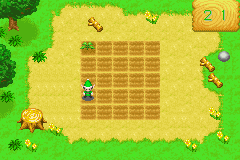
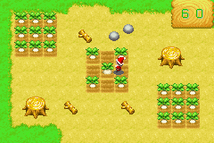
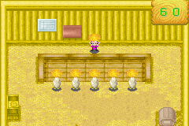

# 一起玩游戏

游戏都有时间限制。在时间内完成数减失败数，就是成绩。
小游戏的成绩会在详细列表里看到，另外帮助干农活会增加熟练度
在精灵的状态栏里可以看到三个槽，分别是浇水，收获，照顾动物。
所以大家努力吧。
另外每天只能和每个精灵玩一次。

## 浇水

在一个5×5个耕地上，电脑会在上边出现3个浇水点，你要记得顺序，指挥精灵依次浇水，A键浇水。
浇水

## 收获

5个食槽前站着5只鸡，食槽里有饲料，当有鸡要吃完时，你要向里边添加，没吃完时添加，鸡会生气，吃完了没加，鸡会离开，你在加入，过一会鸡会回来，每添加成功一次，鸡头上会有音符。
收获

## 照顾动物

这个游戏主要是A键连按，将地中间的罗卜拔起来，不过可不是随便连按就行的，太快罗卜会俩半，太慢则拔不起来。太快时有表示，精灵的脸变红了，这时候要放慢速度。
